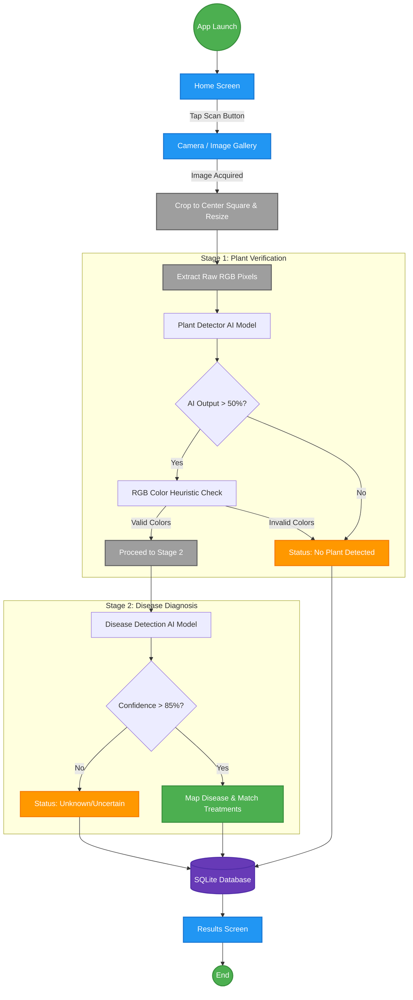

# 🌿 Anigre: AI-Powered Offline Crop Disease Detection System

**Anigre** is a professional-grade, offline-first mobile application designed to help farmers identify crop diseases instantly using on-device Artificial Intelligence. Built with React Native and TensorFlow Lite, it provides high-speed diagnostics without requiring an internet connection.

---

## 🚀 Key Features

### 1. Instant AI Diagnostics
- **39 Disease Categories:** Detects diseases across various crops including Tomato, Apple, Corn, Potato, Grape, and more.
- **Offline Inference:** Uses a custom 191MB TFLite model that runs entirely on the phone's hardware.
- **Smart Viewfinder:** Features a square-cropped camera interface to guide users for the best AI accuracy.

### 2. Treatment & Recommendations
- **Actionable Advice:** Every detection comes with specific organic and chemical treatment recommendations.
- **Severity Assessment:** Automatically calculates disease severity based on AI confidence.

### 3. Local History & Database
- **Offline History:** All scans are saved locally using `expo-sqlite`.
- **Scan Gallery:** Revisit previous detections, images, and treatments anytime, anywhere.

### 4. Community Feed
- **Knowledge Sharing:** A localized social feed where users can share their findings and help other farmers.
- **Image & Video Support:** Full support for uploading agricultural media.

---

## 🧠 System Architecture & Workflow

The proposed system integrates a pre-trained CNN model (converted to TFLite format) directly into the app bundle. We bypass traditional web-camera APIs and use direct hardware hooks to capture raw frames, crop them mathematically, and normalize them before inference.

### Two-Stage Inference Pipeline
The app features a robust two-stage pipeline:
1. **Stage 1 (Plant Verification):** A primary model checks if a leaf is actually present in the image and performs heuristic color checks.
2. **Stage 2 (Disease Diagnosis):** If a plant is verified, the secondary model diagnoses the disease and calculates severity.

### Workflow Diagram



---

## 🛠️ Tech Stack & Methodology

The architecture follows a modular Edge-Computing paradigm:
1. **Presentation Layer:** React Native UI, Vision Camera.
2. **Processing Layer:** Nitro Image (C++), React Native Fast TFLite.
3. **Data Layer:** Expo SQLite for local storage.

| Tech Stack | Purpose |
| :--- | :--- |
| **React Native (Expo)** | Cross-platform frontend framework |
| **TypeScript** | Strongly-typed JavaScript for reliability |
| **RN Vision Camera** | High-performance direct camera access |
| **RN Fast TFLite** | Edge AI Inference engine |
| **Nitro Image** | High-speed C++ memory manipulation |
| **Expo SQLite** | Offline database for history & community |

### System Requirements
| Category | Requirement |
| :--- | :--- |
| **Target OS** | Android 8.0+ / iOS 14.0+ |
| **Minimum RAM** | 4GB (Device) / 256MB+ Heap Allocation |
| **Storage Space** | ~250MB (Due to custom 191MB Model Size) |

---

## 📦 Installation & Setup

### Prerequisites
- Node.js (v18+)
- Android Studio / Xcode
- Java Development Kit (JDK 17)

### Installation
1. Clone the repository:
   ```bash
   git clone https://github.com/SameerKashyap04/AnigreApp.git
   cd "Crop Disease Detection System"
   ```

2. Install dependencies:
   ```bash
   npm install
   ```

3. Setup Android SDK:
   Create a file at `android/local.properties` and add your SDK path:
   ```text
   sdk.dir=/Users/YOUR_NAME/Library/Android/sdk
   ```

4. Run the Development Build:
   ```bash
   npx expo run:android
   ```

---

## 📁 Project Structure

```text
AnigreApp/
│── src/
│   ├── screens/     # ScanScreen, Results, Feed, Auth
│   ├── services/    # MLService.ts, Database.ts, GeminiService.ts, SupabaseService.ts
│   ├── constants/   # Theme and Types
│── assets/
│   ├── model/       # plant_detector.tflite, disease_classifier.tflite, labels.txt
│── android/         # Native configuration (largeHeap: true)
│── App.tsx          # Entry point
```

---

## 📊 Results & Impact

**Advantages of Anigre System:**
1. **Zero latency:** Immediate results within 200ms.
2. **Complete privacy:** Images and farm data never leave the device.
3. **True offline capability:** Works in deep rural areas with zero cellular reception.
4. **Distortion-Free:** Custom bounding-box calculation (`Math.min(width, height)`) extracts the perfect center square to ensure leaf geometry is preserved.

---

## 📄 License
This project is part of the Final Semester Project for Crop Disease Detection. All AI models and source code are proprietary.

*For full project documentation, see the [Detailed Project Report (DPR_Anigre.md)](./DPR_Anigre.md).*
